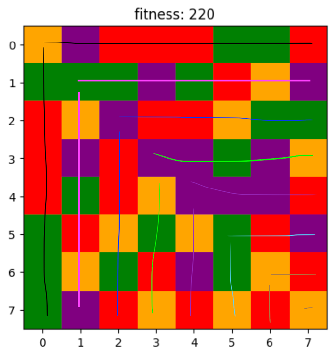

# Genetic Algorithm methodology

1. Create 10 samples (randomized)
2. Fitness function: used to know how it is close to a solution, max fitness is 256, each cell with surround has no duplicate (4 neighbors) get 4 points, 3 neighbors 3 that has not the same color as the cell will be 3 points so on.
3. Selection (selection based on the fitness of each sample the better sample the more chance to be used for a crossover) the ones who have better fitness might do crossover multiple times with other ones.
4. Crossover function: crossover sample A and sample B, in this way, 4 random data in a row will be selected in the first row and will be put into sample B but in the first column, but in other iterations 4 random data will be 3 and less because the size gets smaller.

5.	If we get the result, it will be shown.
6.	If not takes the best one (if couldn’t find the best).
7.	In every 20 iterations, there will be a mutation because normally it can find the result in 20 generations if they don’t get stuck.
8.	Then it shows the best one if we get the result.

Note: please run the Jupyter version because it can show the results better, it will show the board in each generation but only the best ones (local best).
